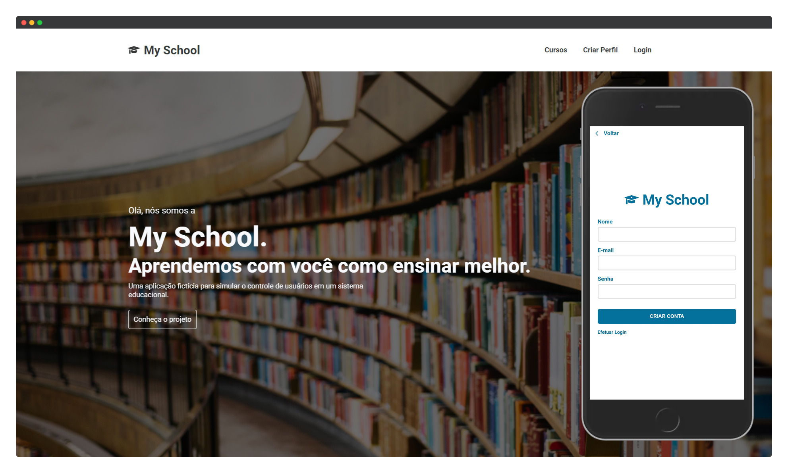

# My School
<p>
  
  
  
</p>

## Sobre

My School é um simples projeto de gerenciamento de usuários feito com o intuito de aplicar ferramentas que tenho estudado recentemente. Nele é possível ver na prática a utilização da stack ReactJS, NextJS e styled-components; material-ui e react-hook-form além de várias outras APIs bastante úteis no desenvolvimento deste tipo de software. Por ser uma aplicação de estudos, não há intenção em disponibilizá-la como produto ou publicá-la para uso em produção. Caso considere alguma parte do código interessante ou acredite que algo possa ser melhorado, fique à vontade para comentar. Todo feedback é bem-vindo.

## Back-end

Para facilitar a manutenção e separar as responsabilidades da aplicação, o back-end encontra-se [neste repositório](https://github.com/rodrigolemos/my-school).

## Definições

O projeto foi dividido em 4 partes separadas por níveis de usuário da seguinte maneira:

- **Visitante** - Esse é o nível mais básico de acesso. Usuários com esse perfil ainda não criaram uma conta ou ainda não estão logados na plataforma. Dessa maneira, é possível acessar a página inicial, a lista de cursos, os detalhes de cada curso, a página de criação de perfil e o login;

- **Aluno** - Esse é o nível mais básico de acesso logado. Usuários com esse perfil, além de poderem fazer tudo o que um visitante faz, podem se cadastrar nos cursos que desejarem, acompanhar seu dashboard de acessos, atualizar seu perfil e posteriormente poderão assistir às aulas cadastradas na plataforma;

- **Professor** - Esse é um nível especial de acesso logado. Professores só podem ser cadastrados na plataforma por administradores. Além de todas as funcionalidades presentes no nível de acesso dos alunos, professores posteriormente poderão cadastrar aulas na plataforma e apontar as notas dos alunos;

- **Administrador** - Esse é o nível de maior privilégio logado. Administradores podem incluir, alterar, atualizar e excluir cursos; incluir ou atualizar acessos de professores e outros administradores; aprovar ou excluir matrículas em determinados cursos. Entretanto, administradores não podem estar matriculados em curso algum.

Além disso, foi implantado um workflow de aprovação de matrícula mediante validação da administração. Nesse fluxo, um **aluno** ou **professor** se cadastra no curso escolhido e entra em uma fila, podendo iniciar o seu curso somente após a atualização do pedido, feita somente por um **administrador**.

## Layout

Exemplo do design adotado para páginas públicas.

<p align="left">
  
</p>

## Tecnologias

Como mencionado, este é um projeto de estudos e tem como premissa o aprendizado e a apresentação de tecnologias, frameworks e ferramentas de desenvolvimento. Segue a lista das principais libs utilizadas:

- [React JS](https://reactjs.org/) - Uma biblioteca JavaScript para criar interfaces de usuário;
- [Next JS](https://nextjs.org/) – Um framework React para produção;
- [Styled Components](https://styled-components.com/) – Uma biblioteca popular para uso de CSS-in-JS;
- [Material UI](https://material-ui.com/) - Biblioteca de componentes React baseada no design Material;
- [Chart JS](https://www.chartjs.org/) – Biblioteca open source de gráficos;
- [react-hook-form](https://react-hook-form.com/) – Biblioteca popular para validação de formulários completos;
- [yup](https://github.com/jquense/yup) – Biblioteca para validação de campos e schemas;
- [date-fns](https://date-fns.org/) – Biblioteca para manipulação de datas;
- [jsonwebtoken](https://www.npmjs.com/package/jsonwebtoken) – Biblioteca para transmissão segura de JWTs;
- [axios](https://github.com/axios/axios) – Cliente HTTP baseado em promises;
- [react-cookie](https://www.npmjs.com/package/react-cookie) – Para manipulação dos cookies;

## Como executar o projeto localmente

Certifique-se que você tenha instalado em sua máquina o [Git](https://git-scm.com) e o [NodeJS](https://nodejs.org/en/). Em seguida, execute os seguintes passos:

```bash
# Clone este repositório
$ git clone https://github.com/rodrigolemos/my-school-front

# Acesse a pasta do projeto
$ cd my-school-front

# Instale as dependências
$ npm install

# Execute a aplicação em modo de desenvolvimento
$ npm run dev
```

Após esses passos, aplicação estará disponível na porta 3001  - http://localhost:3001.

## Autor

Rodrigo Lemos